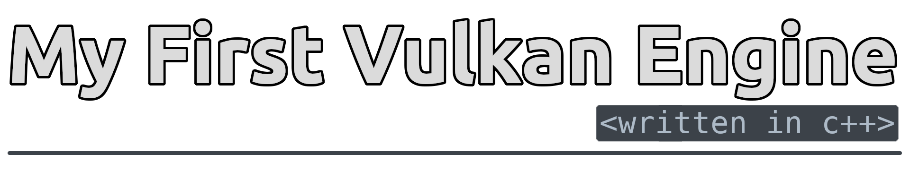

---

  <b> 
My First Vulkan Engine (MFVE) is an open source game and rendering engine written in C++ 17
  </b>

  <b> 
    
    
  </b>

---

# Getting Started
### Platform Support 
  - `Linux`
  - `Windows x64`

The development of this engine is mainly focused on `Linux` so expect missing/incomplete features and bugs on other platforms.

### Prerequisites 
- Download and install the `VulkanSDK` - available on the [LunarG Website](https://vulkan.lunarg.com/sdk/home)
- Download `Premake5` - available here: [https://premake.github.io/](https://premake.github.io/)

### Vendor Dependencies
GLFW is included in the project, but requires additional dependencies to be downloaded depending on your platform. Go to the [GLFW Docs](https://www.glfw.org/docs/latest/compile_guide.html#compile_deps) and install the required dependencies for your platform. Don't worry about generating build files with CMake - this is handled automatically by Premake.

### Cloning The Repository
- Clone the repo recursively to initialise the submodules:
  - HTTPS: `git clone --recursive https://github.com/WSWhitehouse/my-first-vulkan-engine`
  - SSH: `git clone --recursive git@github.com:WSWhitehouse/my-first-vulkan-engine.git`
  
- Or, initialise the submodules if the repository was not cloned recursively:
  - `git submodule update --init`

---

# Setting Up & Building The Application
### Customising Your Application
Your application is automatically generated through Premake. 
In order to change and customise it, you can edit some values from within the premake lua files.

1. Open the `premake5.lua` file in the root of this repository.
2. Edit the variables in the first section of the file.

  <b><i> Don't edit anything below the "Workspace" comment or any other premake / lua files unless you know what you're doing </i></b>

### Running Premake5
1. Open the terminal in the root of the project directory.
2. Run the premake5 command for the IDE / Build System, for example `premake5 vs2019` which will generate Visual Studio 2019 project files. You only need to re-run premake when adding/removing files to the project.

### Building
1. Build the `Generate-Assets` project. This will move the assets to the target directory.
2. Build the application project, which is named the same as the `AppName` field in the premake files (see [Customising Your Application](#customising-your-application) above). 

---

# About MFVE
MFVE is a personal project that was started in the summer of 2021. I initially started by following the [Vulkan Tutorial](https://vulkan-tutorial.com) online, but quickly wanted to grow my engine beyond the tutorial. This engine has been a huge learning experience on so many topics, such as understanding build tools, how engines are structured & programmed, and the Vulkan API itself. 

This engine is not designed to be another "Unity" or "Unreal", it is my first engine after all.

### Initial Goals
- Crossplatform Support
- Use modern C++
- Easy setup and build process (using Premake)
- Make a game using this engine 

---
