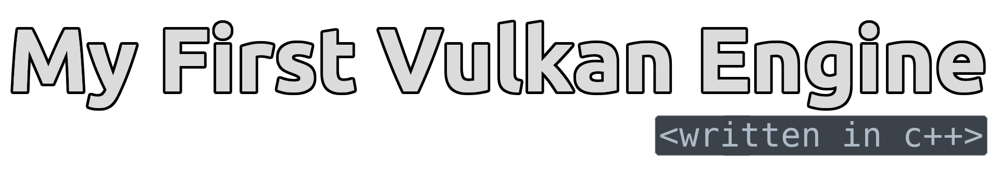

  <b> 
My First Vulkan Engine (MFVE) is an open source game and rendering engine written in modern C++
  </b>

  <b> 
    
    
  </b>

# Getting Started
### Platform Support 
  - `Linux`
  - `Windows x64`

The development of this engine is mainly focused on `Linux` so expect missing/incomplete features and bugs in other platforms.

### Cloning The Repo
- Clone the repo recursively to initialise the submodules
  - `git clone --recursive https://github.com/WSWhitehouse/my-first-vulkan-engine`
  

- Initialise the submodules if the repository was not cloned recursively 
  - `git submodule update --init`

### Running Premake5
1. Download and install premake5. You can download if from here: [`https://premake.github.io/`](https://premake.github.io/)
2. Open the terminal/cmd in the root of the project directory.
3. Run the premake5 command for the required IDE, for example `premake5 vs2019` to generate Visual Studio 2019 project files

# About MFVE
 about ...

# License
This project is under the MIT License. Check out the [License file](https://github.com/WSWhitehouse/my-first-vulkan-engine/blob/main/LICENSE.md) for more information.

